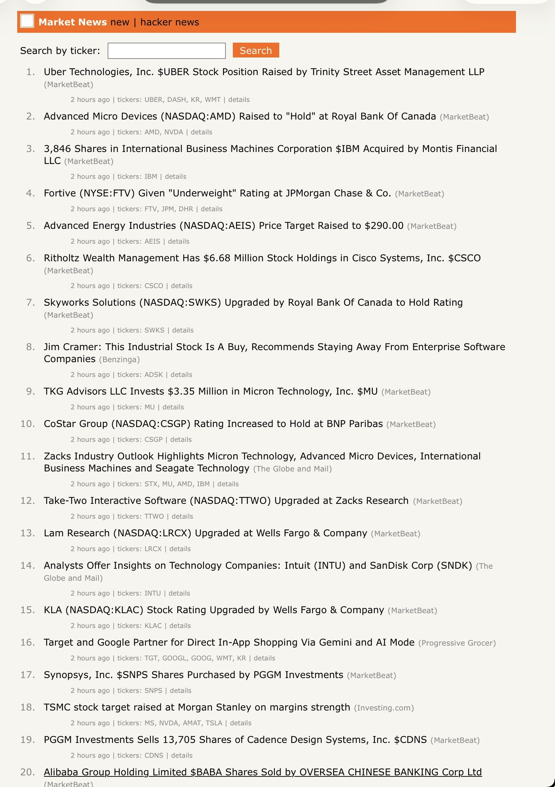

# Technology Market News Aggregator

Daily monitor of technology market news and sentiment displayed in a Hacker News-style web interface. Fully Dockerized for easy deployment.



## Overview

This project fetches technology market news from the AlphaVantage API, stores articles in a MySQL database, and displays them via a Flask web application with a minimalist Hacker News-inspired design. The entire system runs in Docker containers with Gunicorn serving the Flask app for production use.

## Setup

### Prerequisites
- Docker and Docker Compose installed
- AlphaVantage API key

### Quick Start

1. **Configure environment:**
   ```bash
   cp .env.example .env
   ```

   Edit `.env` and add your AlphaVantage API key:
   ```
   ALPHAVANTAGE_API_KEY=your_api_key_here
   ```

2. **Build and start containers:**
   ```bash
   docker compose build
   docker compose up -d
   ```

3. **Initialize database:**
   ```bash
   docker exec marketnews-web uv run python db_setup.py
   ```

   This creates two tables:
   - `market_news`: Stores article information
   - `ticker_sentiments`: Stores ticker sentiment data

4. **Access the application:**
   - Web interface: http://localhost:5000
   - Network access: http://LOCAL_IP:5000

## Usage

### Docker Commands

**Fetch news articles manually:**
```bash
docker exec marketnews-web uv run python marketnews.py
```

**View application logs:**
```bash
docker logs -f marketnews-web
```

**Access MySQL database:**
```bash
docker exec marketnews-db mysql -u marketnews -pmarketnews_pass marketnews
```

**Restart services:**
```bash
docker compose restart
```

**Stop containers:**
```bash
docker compose down
```

**Stop and remove all data:**
```bash
docker compose down -v
```

### Database Backup and Restore

**Backup the database:**
```bash
docker exec marketnews-db mysqldump -u marketnews -pmarketnews_pass marketnews > marketnews_backup_$(date +%Y%m%d_%H%M%S).sql
```

**Restore from a backup:**
```bash
docker exec -i marketnews-db mysql -u marketnews -pmarketnews_pass marketnews < marketnews_backup_YYYYMMDD_HHMMSS.sql
```

### Automated Daily Execution

The cron job runs daily at 10:00 AM EST:
```bash
0 10 * * * docker exec marketnews-web uv run python marketnews.py
```

## Features

### Core Functionality
- **News Aggregation**: Fetches up to 50 technology news articles from AlphaVantage API daily
- **Source Filtering**: Automatically excludes articles from banned sources (currently "Motley Fool")
- **MySQL Storage**: Stores articles and ticker sentiments in structured database tables
- **Automated Updates**: Cron-based daily fetching at 10:00 AM EST

### Web Interface
- **Hacker News-Style UI**: Clean, minimalist web interface inspired by Hacker News
  - Orange header bar (#ff6600)
  - Numbered article list
  - Time ago display (e.g., "2 hours ago")
  - Clickable ticker symbols
- **Search Functionality**: Search articles by ticker symbol
- **Article Details**: Full article view with:
  - Complete summary
  - Ticker sentiment table with scores and relevance
  - Link to original article
- **Pagination**: 30 articles per page with "More" navigation

### Infrastructure
- **Fully Dockerized**: Easy deployment with Docker Compose
- **Production-Ready**: Gunicorn WSGI server with 4 workers
- **Persistent Storage**: Docker volumes for database persistence
- **Environment-Based Config**: All credentials via environment variables
- **Comprehensive Logging**: Full logging for monitoring and debugging
- **Error Handling**: Robust error recovery for API failures

## Files

### Python Application
- **`marketnews.py`**: Main program for fetching news and storing in MySQL
- **`app.py`**: Flask web application with Hacker News-style interface
- **`db_setup.py`**: Database initialization script
- **`mcp_server.py`**: MCP server for querying the database via Claude Code

### Docker Configuration
- **`Dockerfile`**: Container image definition (Python 3.13 + uv + gunicorn)
- **`docker-compose.yml`**: Multi-container orchestration (MySQL + Flask + MCP server)
- **`.dockerignore`**: Files excluded from Docker build

### Web Assets
- **`templates/`**: Flask HTML templates (layout, index, article detail)
- **`static/`**: CSS stylesheets (Hacker News-inspired design)

### Configuration
- **`.env`**: Environment variables (API key, database credentials)
- **`.env.example`**: Template for environment configuration
- **`pyproject.toml`**: Python dependencies managed by uv

## Database Schema

**market_news table:**
- `id`, `title`, `summary`, `url`, `source`, `published_time`, `created_at`

**ticker_sentiments table:**
- `id`, `article_id`, `ticker`, `sentiment_label`, `sentiment_score`, `relevance_score`

## Architecture

```
┌─────────────────────────────────────────────┐
│            Host Machine (Cron)              │
│  ┌───────────────────────────────────────┐  │
│  │ 0 10 * * * docker exec marketnews-web │  │
│  │   uv run python marketnews.py         │  │
│  └───────────────────────────────────────┘  │
└──────────────────┬──────────────────────────┘
                   │
┌──────────────────▼──────────────────────────┐
│           Docker Compose                    │
│                                             │
│  ┌─────────────────┐  ┌─────────────────┐  │
│  │ marketnews-web  │  │ marketnews-db   │  │
│  │                 │  │                 │  │
│  │ Flask + Gunicorn│──│ MySQL 8.0       │  │
│  │ Port 5000       │  │ Port 3307       │  │
│  └─────────────────┘  └────────┬────────┘  │
│                                 │            │
│                        ┌────────┴────────┐  │
│                        │ marketnews-mcp  │  │
│                        │                 │  │
│                        │ MCP (streamable-│  │
│                        │ http), Port 9001│  │
│                        └─────────────────┘  │
│         │                      │            │
│         │                      │            │
│      Volume               Volume            │
│     (code)            (db_data)             │
└─────────────────────────────────────────────┘
```

## MCP Server

`mcp_server.py` exposes the marketnews database as an MCP server, enabling natural language queries over articles and sentiment data without writing SQL. Transport is controlled by env vars: `MCP_TRANSPORT` (`stdio` default, or `sse`/`streamable-http`), `MCP_HOST`, and `MCP_PORT` (default `9001`).

**Register with Claude Code (stdio):**
```bash
claude mcp add marketnews -- uv run --project /path/to/marketnews python /path/to/marketnews/mcp_server.py
```

**Docker (streamable-http, for non-stdio clients like Hermes Agent):**

The `mcp` service in `docker-compose.yml` runs with `MCP_TRANSPORT=streamable-http`, publishing port 9001:
```bash
docker compose up -d mcp
```

From another Docker container on the same host, point the client at:
```
http://host.docker.internal:9001/mcp
```
(On Linux hosts without Docker Desktop, use the host's LAN IP instead of `host.docker.internal`, or add `extra_hosts: ["host.docker.internal:host-gateway"]` to the client's service.)

**Available tools:**

| Tool | Description |
|------|-------------|
| `search_articles` | Search by keyword, ticker, source, and/or date range |
| `get_article` | Fetch a single article with full summary and ticker sentiments |
| `get_sentiment_report` | Tickers ranked by average sentiment score |
| `get_top_tickers` | Tickers ranked by total mentions or average sentiment score |
| `get_daily_summary` | Article count, top sources, and top tickers for a given date |

## References

- [AlphaVantage API Documentation](https://www.alphavantage.co/documentation/)
- [Flask Documentation](https://flask.palletsprojects.com/)
- [Hacker News](https://news.ycombinator.com/)
- [Docker Documentation](https://docs.docker.com/)
- [Gunicorn Documentation](https://docs.gunicorn.org/)
